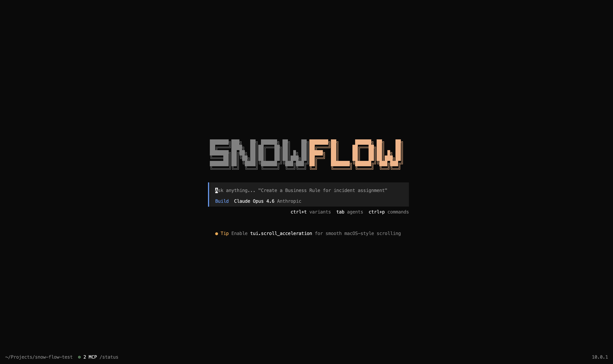

<p align="center">
<pre align="center">
███████╗███╗   ██╗ ██████╗ ██╗    ██╗███████╗██╗      ██████╗ ██╗    ██╗
██╔════╝████╗  ██║██╔═══██╗██║    ██║██╔════╝██║     ██╔═══██╗██║    ██║
███████╗██╔██╗ ██║██║   ██║██║ █╗ ██║█████╗  ██║     ██║   ██║██║ █╗ ██║
╚════██║██║╚██╗██║██║   ██║██║███╗██║██╔══╝  ██║     ██║   ██║██║███╗██║
███████║██║ ╚████║╚██████╔╝╚███╔███╔╝██║     ███████╗╚██████╔╝╚███╔███╔╝
╚══════╝╚═╝  ╚═══╝ ╚═════╝  ╚══╝╚══╝ ╚═╝     ╚══════╝ ╚═════╝  ╚══╝╚══╝
</pre>
</p>
<p align="center">Der Open-Source KI-Coding-Agent.</p>
<p align="center">
  <a href="https://www.npmjs.com/package/snow-flow"></a>
  <a href="https://github.com/groeimetai/snow-flow/actions/workflows/publish.yml"></a>
</p>

<p align="center">
  <a href="README.md">English</a> |
  <a href="README.zh.md">简体中文</a> |
  <a href="README.zht.md">繁體中文</a> |
  <a href="README.ko.md">한국어</a> |
  <a href="README.de.md">Deutsch</a> |
  <a href="README.es.md">Español</a> |
  <a href="README.fr.md">Français</a> |
  <a href="README.it.md">Italiano</a> |
  <a href="README.da.md">Dansk</a> |
  <a href="README.ja.md">日本語</a> |
  <a href="README.pl.md">Polski</a> |
  <a href="README.ru.md">Русский</a> |
  <a href="README.ar.md">العربية</a> |
  <a href="README.no.md">Norsk</a> |
  <a href="README.br.md">Português (Brasil)</a>
</p>

[](https://snow-flow.dev)

---

### Installation

```bash
# YOLO
curl -fsSL https://snow-flow.dev/install | bash

# Paketmanager
npm i -g snow-flow@latest        # oder bun/pnpm/yarn
scoop install snow-flow             # Windows
choco install snow-flow             # Windows
brew install groeimetai/tap/snow-flow # macOS und Linux (empfohlen, immer aktuell)
brew install snow-flow              # macOS und Linux (offizielle Brew-Formula, seltener aktualisiert)
paru -S snow-flow-bin               # Arch Linux
mise use -g snow-flow               # jedes Betriebssystem
nix run nixpkgs#snow-flow           # oder github:groeimetai/snow-flow für den neuesten dev-Branch
```

> [!TIP]
> Entferne Versionen älter als 0.1.x vor der Installation.

#### Installationsverzeichnis

Das Installationsskript beachtet die folgende Prioritätsreihenfolge für den Installationspfad:

1. `$SNOW_FLOW_INSTALL_DIR` - Benutzerdefiniertes Installationsverzeichnis
2. `$XDG_BIN_DIR` - XDG Base Directory Specification-konformer Pfad
3. `$HOME/bin` - Standard-Binärverzeichnis des Users (falls vorhanden oder erstellbar)
4. `$HOME/.snow-flow/bin` - Standard-Fallback

```bash
# Beispiele
SNOW_FLOW_INSTALL_DIR=/usr/local/bin curl -fsSL https://snow-flow.dev/install | bash
XDG_BIN_DIR=$HOME/.local/bin curl -fsSL https://snow-flow.dev/install | bash
```

### Agents

Snow-Flow enthält zwei eingebaute Agents, zwischen denen du mit der `Tab`-Taste wechseln kannst.

- **build** - Standard-Agent mit vollem Zugriff für Entwicklungsarbeit
- **plan** - Nur-Lese-Agent für Analyse und Code-Exploration
  - Verweigert Datei-Edits standardmäßig
  - Fragt vor dem Ausführen von bash-Befehlen nach
  - Ideal zum Erkunden unbekannter Codebases oder zum Planen von Änderungen

Außerdem ist ein **general**-Subagent für komplexe Suchen und mehrstufige Aufgaben enthalten.
Dieser wird intern genutzt und kann in Nachrichten mit `@general` aufgerufen werden.

Mehr dazu unter [Agents](https://snow-flow.dev/docs/agents).

### Dokumentation

Mehr Infos zur Konfiguration von Snow-Flow findest du in unseren [**Docs**](https://snow-flow.dev/docs).

### Beitragen

Wenn du zu Snow-Flow beitragen möchtest, lies bitte unsere [Contributing Docs](./CONTRIBUTING.md), bevor du einen Pull Request einreichst.

### Auf Snow-Flow aufbauen

Wenn du an einem Projekt arbeitest, das mit Snow-Flow zusammenhängt und "snow-flow" als Teil seines Namens verwendet (z.B. "snow-flow-dashboard" oder "snow-flow-mobile"), füge bitte einen Hinweis in deine README ein, dass es nicht vom Snow-Flow-Team gebaut wird und nicht in irgendeiner Weise mit uns verbunden ist.

### FAQ

#### Worin unterscheidet sich das von Claude Code?

In Bezug auf die Fähigkeiten ist es Claude Code sehr ähnlich. Hier sind die wichtigsten Unterschiede:

- 100% open source
- Nicht an einen Anbieter gekoppelt. Wir empfehlen die Modelle aus [Snow-Flow Zen](https://snow-flow.dev/zen); Snow-Flow kann aber auch mit Claude, OpenAI, Google oder sogar lokalen Modellen genutzt werden. Mit der Weiterentwicklung der Modelle werden die Unterschiede kleiner und die Preise sinken, deshalb ist Provider-Unabhängigkeit wichtig.
- LSP-Unterstützung direkt nach dem Start
- Fokus auf TUI. Snow-Flow wird von Neovim-Nutzern und den Machern von [terminal.shop](https://terminal.shop) gebaut; wir treiben die Grenzen dessen, was im Terminal möglich ist.
- Client/Server-Architektur. Das ermöglicht z.B., Snow-Flow auf deinem Computer laufen zu lassen, während du es von einer mobilen App aus fernsteuerst. Das TUI-Frontend ist nur einer der möglichen Clients.

---
