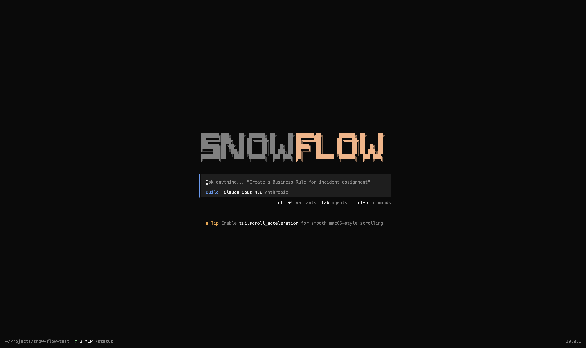

<p align="center">
<pre align="center">
███████╗███████╗██████╗  █████╗  ██████╗
██╔════╝██╔════╝██╔══██╗██╔══██╗██╔════╝
███████╗█████╗  ██████╔╝███████║██║     
╚════██║██╔══╝  ██╔══██╗██╔══██║██║     
███████║███████╗██║  ██║██║  ██║╚██████╗
╚══════╝╚══════╝╚═╝  ╚═╝╚═╝  ╚═╝ ╚═════╝
</pre>
</p>
<p align="center">L'agente di coding AI open source.</p>
<p align="center">
  <a href="https://www.npmjs.com/package/snow-flow"></a>
  <a href="https://github.com/groeimetai/snow-flow/actions/workflows/publish.yml"></a>
</p>

<p align="center">
  <a href="README.md">English</a> |
  <a href="README.zh.md">简体中文</a> |
  <a href="README.zht.md">繁體中文</a> |
  <a href="README.ko.md">한국어</a> |
  <a href="README.de.md">Deutsch</a> |
  <a href="README.es.md">Español</a> |
  <a href="README.fr.md">Français</a> |
  <a href="README.it.md">Italiano</a> |
  <a href="README.da.md">Dansk</a> |
  <a href="README.ja.md">日本語</a> |
  <a href="README.pl.md">Polski</a> |
  <a href="README.ru.md">Русский</a> |
  <a href="README.ar.md">العربية</a> |
  <a href="README.no.md">Norsk</a> |
  <a href="README.br.md">Português (Brasil)</a>
</p>

[](https://snow-flow.dev)

---

### Installazione

```bash
# YOLO
curl -fsSL https://snow-flow.dev/install | bash

# Package manager
npm i -g snow-flow@latest        # oppure bun/pnpm/yarn
scoop install snow-flow             # Windows
choco install snow-flow             # Windows
brew install groeimetai/tap/snow-flow # macOS e Linux (consigliato, sempre aggiornato)
brew install snow-flow              # macOS e Linux (formula brew ufficiale, aggiornata meno spesso)
paru -S snow-flow-bin               # Arch Linux
mise use -g snow-flow               # Qualsiasi OS
nix run nixpkgs#snow-flow           # oppure github:groeimetai/snow-flow per l’ultima branch di sviluppo
```

> [!TIP]
> Rimuovi le versioni precedenti alla 0.1.x prima di installare.

#### Directory di installazione

Lo script di installazione rispetta il seguente ordine di priorità per il percorso di installazione:

1. `$SNOW_FLOW_INSTALL_DIR` – Directory di installazione personalizzata
2. `$XDG_BIN_DIR` – Percorso conforme alla XDG Base Directory Specification
3. `$HOME/bin` – Directory binaria standard dell’utente (se esiste o può essere creata)
4. `$HOME/.snow-flow/bin` – Fallback predefinito

```bash
# Esempi
SNOW_FLOW_INSTALL_DIR=/usr/local/bin curl -fsSL https://snow-flow.dev/install | bash
XDG_BIN_DIR=$HOME/.local/bin curl -fsSL https://snow-flow.dev/install | bash
```

### Agenti

Snow-Flow include due agenti integrati tra cui puoi passare usando il tasto `Tab`.

- **build** – Predefinito, agente con accesso completo per il lavoro di sviluppo
- **plan** – Agente in sola lettura per analisi ed esplorazione del codice
  - Nega le modifiche ai file per impostazione predefinita
  - Chiede il permesso prima di eseguire comandi bash
  - Ideale per esplorare codebase sconosciute o pianificare modifiche

È inoltre incluso un sotto-agente **general** per ricerche complesse e attività multi-step.
Viene utilizzato internamente e può essere invocato usando `@general` nei messaggi.

Scopri di più sugli [agenti](https://snow-flow.dev/docs/agents).

### Documentazione

Per maggiori informazioni su come configurare Snow-Flow, [**consulta la nostra documentazione**](https://snow-flow.dev/docs).

### Contribuire

Se sei interessato a contribuire a Snow-Flow, leggi la nostra [guida alla contribuzione](./CONTRIBUTING.md) prima di inviare una pull request.

### Costruire su Snow-Flow

Se stai lavorando a un progetto correlato a Snow-Flow e che utilizza "snow-flow" come parte del nome (ad esempio “snow-flow-dashboard” o “snow-flow-mobile”), aggiungi una nota nel tuo README per chiarire che non è sviluppato dal team Snow-Flow e che non è affiliato in alcun modo con noi.

### FAQ

#### In cosa è diverso da Claude Code?

È molto simile a Claude Code in termini di funzionalità. Ecco le principali differenze:

- 100% open source
- Non è legato a nessun provider. Anche se consigliamo i modelli forniti tramite [Snow-Flow Zen](https://snow-flow.dev/zen), Snow-Flow può essere utilizzato con Claude, OpenAI, Google o persino modelli locali. Con l’evoluzione dei modelli, le differenze tra di essi si ridurranno e i prezzi scenderanno, quindi essere indipendenti dal provider è importante.
- Supporto LSP pronto all’uso
- Forte attenzione alla TUI. Snow-Flow è sviluppato da utenti neovim e dai creatori di [terminal.shop](https://terminal.shop); spingeremo al limite ciò che è possibile fare nel terminale.
- Architettura client/server. Questo, ad esempio, permette a Snow-Flow di girare sul tuo computer mentre lo controlli da remoto tramite un’app mobile. La frontend TUI è quindi solo uno dei possibili client.

---
