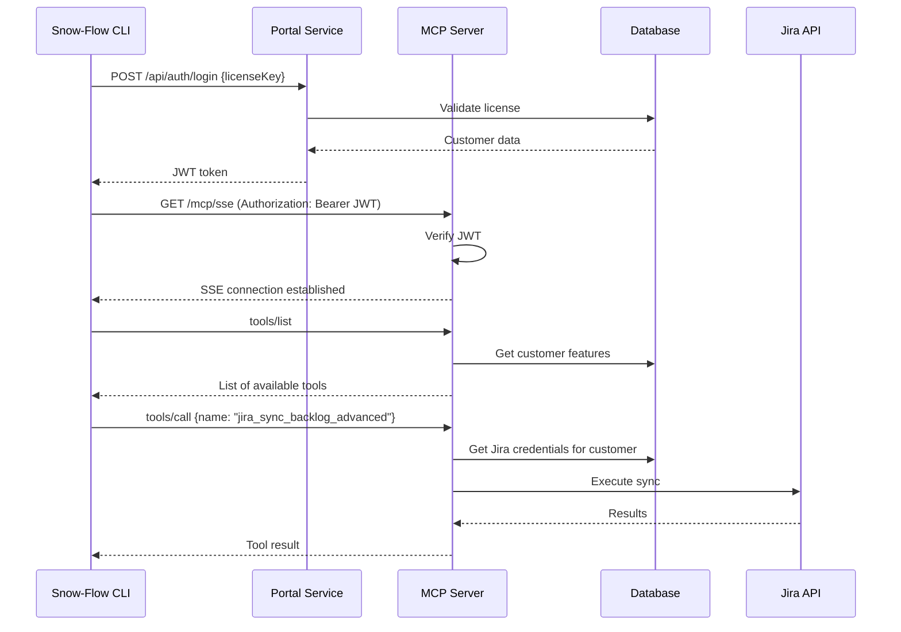

# Snow-Flow Enterprise MCP Server

## Overview

The **Snow-Flow Enterprise MCP Server** provides enterprise-exclusive tools for Snow-Flow customers via the Model Context Protocol (MCP). It exposes 26 advanced tools for:

- **Jira Integration**: Bidirectional sync, advanced analytics, sprint automation
- **Azure DevOps**: Work item management, pipeline integration, board sync
- **Confluence**: Page management, space organization, content search

The server runs as an independent Cloud Run service and uses Server-Sent Events (SSE) for real-time communication with Snow-Flow CLI clients.

## Architecture

```
┌─────────────────────────────────────────────────────────────┐
│                     MCP Server                              │
│                (enterprise.snow-flow.dev)                   │
├─────────────────────────────────────────────────────────────┤
│                                                             │
│  ┌─────────────────┐         ┌───────────────────┐        │
│  │   SSE Endpoint  │ ◄─────► │  MCP SDK Server   │        │
│  │  /mcp/sse       │         │  (Tool Registry)  │        │
│  └─────────────────┘         └───────────────────┘        │
│           │                          │                      │
│           │                          ▼                      │
│           │                  ┌───────────────┐             │
│           │                  │  Tool Handlers│             │
│           │                  │  - Jira (10)  │             │
│           │                  │  - Azure (8)  │             │
│           │                  │  - Confluence(8)│           │
│           │                  └───────────────┘             │
│           │                          │                      │
│           ▼                          ▼                      │
│   ┌──────────────┐          ┌───────────────┐             │
│   │ JWT Verifier │          │  Credentials  │             │
│   │              │          │   Database    │             │
│   └──────────────┘          └───────────────┘             │
│                                                             │
└─────────────────────────────────────────────────────────────┘
           │                          │
           ▼                          ▼
┌────────────────────┐      ┌────────────────────┐
│   External APIs    │      │    PostgreSQL      │
│  - Jira REST API   │      │   (Credentials)    │
│  - Azure REST API  │      │                    │
│  - Confluence API  │      │                    │
└────────────────────┘      └────────────────────┘
```

### Technology Stack

- **MCP SDK**: @modelcontextprotocol/sdk v1.0.0
- **Runtime**: Node.js 20 + TypeScript
- **Transport**: SSE (Server-Sent Events)
- **Authentication**: JWT (verified from Portal)
- **Database**: PostgreSQL (Cloud SQL)
- **External SDKs**: jira-client, azure-devops-node-api, confluence.js

## Available Tools (26)

### Jira Tools (10)

| Tool | Description | Complexity |
|------|-------------|------------|
| `jira_sync_backlog_advanced` | Full backlog sync with custom fields, attachments | Advanced |
| `jira_ai_sprint_planning` | AI-powered sprint planning with ML recommendations | Expert |
| `jira_bulk_operations` | Bulk issue updates (up to 100 issues) | Intermediate |
| `jira_advanced_analytics` | Cycle time, burndown, velocity metrics | Advanced |
| `jira_dependency_mapping` | Visualize issue dependencies and blockers | Advanced |
| `jira_release_management` | Manage versions, fix versions, release notes | Intermediate |
| `jira_custom_automation` | Create custom automation rules | Advanced |
| `jira_advanced_search` | Complex JQL queries with aggregations | Intermediate |
| `jira_time_tracking` | Worklog management and time reports | Beginner |
| `jira_webhook_management` | Configure webhooks for real-time sync | Advanced |

### Azure DevOps Tools (8)

| Tool | Description | Complexity |
|------|-------------|------------|
| `azure_sync_work_items` | Sync work items bidirectionally | Intermediate |
| `azure_pipeline_integration` | Trigger and monitor CI/CD pipelines | Advanced |
| `azure_board_automation` | Automate board movements and status changes | Advanced |
| `azure_git_integration` | Pull request management, branch policies | Intermediate |
| `azure_test_management` | Test plans, cases, and execution | Advanced |
| `azure_release_orchestration` | Multi-stage release management | Expert |
| `azure_analytics` | Velocity, lead time, deployment frequency | Advanced |
| `azure_work_item_templates` | Create and apply work item templates | Intermediate |

### Confluence Tools (8)

| Tool | Description | Complexity |
|------|-------------|------------|
| `confluence_sync_pages` | Sync pages with ServiceNow KB articles | Intermediate |
| `confluence_space_management` | Create, configure, and manage spaces | Intermediate |
| `confluence_advanced_search` | CQL (Confluence Query Language) search | Advanced |
| `confluence_content_organization` | Labels, categories, page hierarchies | Intermediate |
| `confluence_macro_management` | Insert and configure macros programmatically | Advanced |
| `confluence_analytics` | Page views, popular content, engagement | Intermediate |
| `confluence_permissions` | Space and page permission management | Advanced |
| `confluence_attachment_sync` | Sync attachments with ServiceNow | Intermediate |

## Authentication Flow



## Directory Structure

```
mcp-server/
├── src/
│   ├── index.ts             # Main entry point + SSE endpoint
│   ├── tools/               # Tool implementations
│   │   ├── jira/
│   │   │   ├── sync-backlog.ts
│   │   │   ├── ai-sprint-planning.ts
│   │   │   ├── bulk-operations.ts
│   │   │   └── ...
│   │   ├── azure/
│   │   │   ├── sync-work-items.ts
│   │   │   ├── pipeline-integration.ts
│   │   │   └── ...
│   │   └── confluence/
│   │       ├── sync-pages.ts
│   │       ├── space-management.ts
│   │       └── ...
│   ├── database/            # Database clients
│   │   ├── credentials.ts   # Credentials lookup
│   │   └── usage-logs.ts    # Usage tracking
│   ├── middleware/          # JWT verification
│   └── types/               # TypeScript types
├── package.json
├── tsconfig.json
├── Dockerfile
├── cloudbuild.yaml
└── README.md                # This file
```

## Tool Implementation Example

```typescript
// src/tools/jira/sync-backlog.ts
import JiraClient from 'jira-client';

export async function jiraSyncBacklog(
  args: {
    projectKey: string;
    includeSubtasks?: boolean;
    customFields?: string[];
  },
  context: {
    credentials: JiraCredentials;
    db: Database;
    logger: Logger;
  }
): Promise<{ issues: any[]; syncedCount: number }> {
  const { projectKey, includeSubtasks, customFields } = args;
  const { credentials, db, logger } = context;

  // Initialize Jira client with customer's credentials
  const jira = new JiraClient({
    host: credentials.host,
    username: credentials.email,
    password: credentials.apiToken,
    protocol: 'https',
    apiVersion: '2',
    strictSSL: true
  });

  logger.info(`Syncing backlog for project ${projectKey}`);

  // Fetch issues with JQL
  const jql = includeSubtasks
    ? `project = ${projectKey} ORDER BY rank ASC`
    : `project = ${projectKey} AND issuetype != Sub-task ORDER BY rank ASC`;

  const issues = await jira.searchJira(jql, {
    fields: ['summary', 'status', 'assignee', ...(customFields || [])],
    maxResults: 1000
  });

  // Log usage
  await db.logToolUsage({
    toolName: 'jira_sync_backlog_advanced',
    customerId: context.customerId,
    itemsProcessed: issues.issues.length
  });

  return {
    issues: issues.issues,
    syncedCount: issues.issues.length
  };
}
```

## Credential Management

All credentials are:
1. **Stored encrypted** in PostgreSQL (AES-256)
2. **Fetched per-request** from database (no caching)
3. **Never logged** or exposed in responses
4. **Validated** before use (test connection)

**Credentials lookup flow:**
```typescript
// In tool handler
const credentials = await credsDb.getCredentials(
  jwtPayload.customerId,  // From verified JWT
  'jira'                   // Integration type
);

if (!credentials || !credentials.configured) {
  throw new Error('Jira not configured. Please configure in Portal.');
}

// Use credentials
const jira = new JiraClient({
  host: credentials.host,
  username: credentials.email,
  password: credentials.apiToken
});
```

## Local Development

### Prerequisites

- Node.js 20+
- PostgreSQL (with credentials schema)
- Valid JWT token from Portal (for testing)

### Setup

1. **Install dependencies:**
```bash
cd /Users/nielsvanderwerf/snow-flow-enterprise/mcp-server
npm install
```

2. **Configure environment:**
```bash
cat > .env << EOF
DB_TYPE=postgres
DB_HOST=localhost
DB_PORT=5432
DB_NAME=snow_flow_dev
DB_USER=postgres
DB_PASSWORD=postgres
JWT_SECRET=dev-secret-change-in-production
NODE_ENV=development
PORT=8081
EOF
```

3. **Run migrations:**
```bash
npm run migrate
```

### Running Locally

**Development mode (auto-reload):**
```bash
npm run dev  # Runs on http://localhost:8081
```

**Production mode:**
```bash
npm run build
npm start
```

### Testing with curl

1. **Get JWT token from Portal:**
```bash
TOKEN=$(curl -X POST http://localhost:8080/api/auth/login \
  -H "Content-Type: application/json" \
  -d '{"licenseKey": "SF-ENT-TEST-KEY"}' \
  | jq -r '.token')
```

2. **Connect to SSE endpoint:**
```bash
curl -N http://localhost:8081/mcp/sse \
  -H "Authorization: Bearer $TOKEN"
```

Expected: SSE connection established, initial handshake messages

3. **Call a tool** (requires MCP client):
```bash
# Use snow-flow CLI or MCP inspector
snow-flow-mcp-inspector --url http://localhost:8081/mcp/sse --token $TOKEN
```

## Testing

**Unit tests:**
```bash
npm test
```

**Integration tests (requires credentials):**
```bash
npm run test:integration
```

**Test specific tool:**
```bash
npm test -- src/tools/jira/sync-backlog.test.ts
```

## Deployment

See [SPLIT-SERVICES-DEPLOYMENT.md](../SPLIT-SERVICES-DEPLOYMENT.md) for full deployment guide.

**Quick deploy:**
```bash
gcloud builds submit --config=mcp-server/cloudbuild.yaml
```

## Environment Variables

| Variable | Required | Description |
|----------|----------|-------------|
| `DB_TYPE` | Yes | Database type (postgres or mysql) |
| `DB_HOST` | Yes | Database host (Cloud SQL connection name) |
| `DB_PORT` | Yes | Database port |
| `DB_NAME` | Yes | Database name |
| `DB_USER` | Yes | Database user |
| `DB_PASSWORD` | Yes | Database password |
| `JWT_SECRET` | Yes | JWT verification secret (MUST match Portal!) |
| `NODE_ENV` | Yes | Environment (development/production) |
| `PORT` | Yes | Server port (default 8081) |

## Feature Gating

Tools are automatically filtered based on customer's license tier:

| Tier | Available Tools |
|------|----------------|
| **Community** | None (open source tools only) |
| **Professional** | Jira basic (5 tools) |
| **Team** | Jira + Azure DevOps basic (13 tools) |
| **Enterprise** | All tools (26 tools) |

**Implementation:**
```typescript
// In MCP server request handler
mcpServer.setRequestHandler('tools/list', async () => {
  const customerFeatures = jwtPayload.features || [];

  const availableTools = ENTERPRISE_TOOLS.filter(tool =>
    customerFeatures.includes(tool.feature)
  );

  return { tools: availableTools.map(t => ({ name: t.name })) };
});
```

## Performance

**Target Metrics:**
- **Tool call latency**: < 500ms (p50), < 2s (p99)
- **SSE connection time**: < 100ms
- **Concurrent connections**: Up to 50 per instance
- **Tool timeout**: 600s (10 minutes)

**Optimization techniques:**
- Connection pooling for database
- Credential caching (in-memory, 5 min TTL)
- Pagination for large result sets
- Async processing for long-running operations

## Monitoring

**Health check:**
```bash
curl https://enterprise.snow-flow.dev/health
```

**Metrics (Cloud Monitoring):**
- Tool call success rate
- Tool call latency (by tool)
- Active SSE connections
- Credential fetch time
- External API errors

**Logging:**
All tool calls are logged with:
- Customer ID
- Tool name
- Execution time
- Items processed
- Errors (if any)

## Error Handling

**Common errors:**

| Error | Cause | Resolution |
|-------|-------|-----------|
| `401 Unauthorized` | Invalid/expired JWT | Re-login via Portal |
| `403 Forbidden` | Tool not in customer's tier | Upgrade license |
| `404 Not Found` | Tool doesn't exist | Check tool name |
| `500 Internal Error` | Tool execution failed | Check logs |
| `503 Service Unavailable` | External API down | Retry later |

**Error response format:**
```json
{
  "error": {
    "code": "CREDENTIALS_NOT_CONFIGURED",
    "message": "Jira credentials not configured. Please configure in Portal.",
    "details": {
      "integration": "jira",
      "portalUrl": "https://portal.snow-flow.dev/integrations/jira"
    }
  }
}
```

## Security

- **JWT Verification**: Every request verifies JWT signature
- **Credential Encryption**: AES-256 at rest
- **HTTPS Only**: No plain HTTP in production
- **Rate Limiting**: 100 tool calls per minute per customer
- **Audit Logging**: All tool calls logged
- **IP Allowlisting**: Optional for enterprise customers

## Adding New Tools

1. **Create tool handler** in `src/tools/{integration}/{tool-name}.ts`
2. **Register tool** in `src/index.ts`:
```typescript
const ENTERPRISE_TOOLS = [
  // ... existing tools
  { name: 'new_tool_name', handler: newToolHandler, feature: 'integration-name' }
];
```
3. **Add tests** in `src/tools/{integration}/{tool-name}.test.ts`
4. **Update documentation** (this README + user docs)
5. **Deploy** via Cloud Build

## Support

- **Issues**: https://github.com/snow-flow/snow-flow-enterprise/issues
- **Docs**: https://docs.snow-flow.dev/enterprise/mcp-server
- **Email**: support@snow-flow.dev
- **Slack**: #snow-flow-enterprise (for partners)

---

**Version**: 2.0.0
**Last Updated**: 2025-10-27
